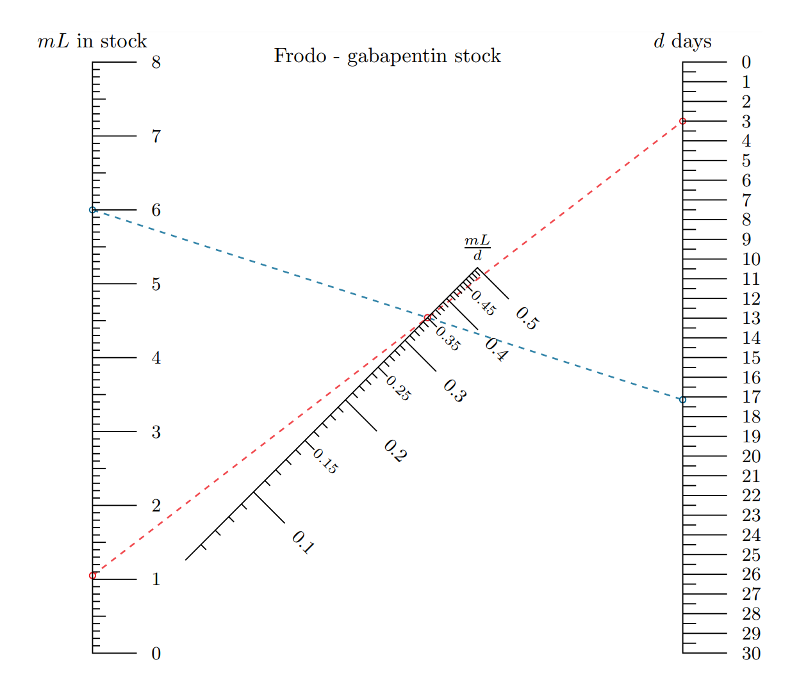

## nomographs

These are nomographs I rendered using the python library [PyNomo](http://pynomo.org/wiki/index.php/Main_Page)

[frodo-meds.py](./frodo-meds.py) | Relates medicine inventory to dose levels for my cat. The blue isopleth answers the question "how many days does a new supply of 6 mL last" at the current dose level. The red isopleth answers the question "how many mL do I have left when I have 3 days to go" at current level

